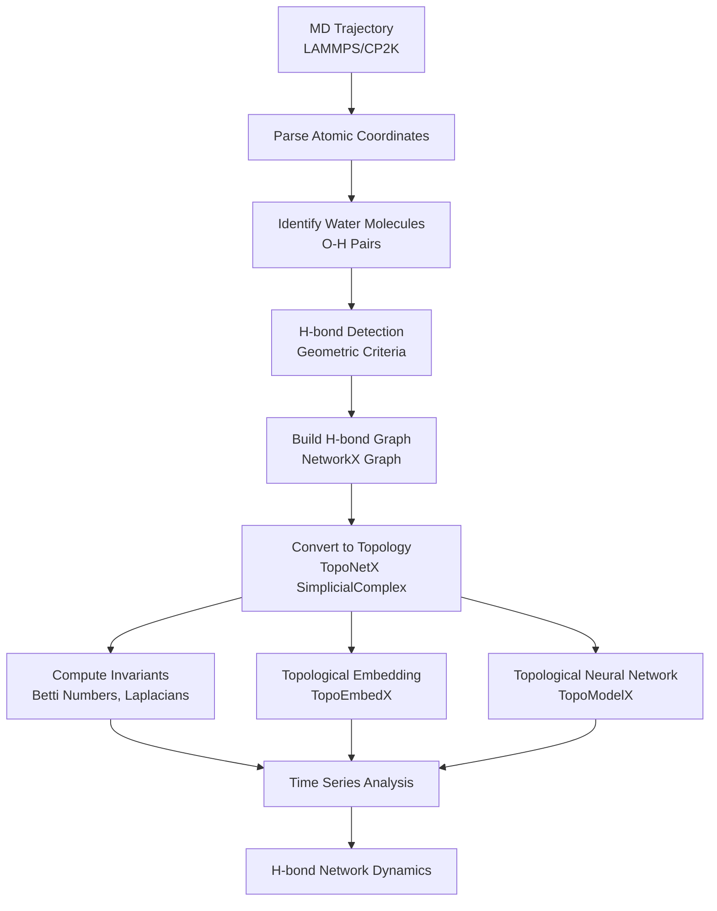

# Hydrogen Bond Network Topology Analysis

[](https://github.com/TANG-LAB-WHU/topoHBNet/actions/workflows/test.yml)
[](https://www.python.org/downloads/)
[](https://opensource.org/licenses/MIT)

Analyze hydrogen bond (H-bond) network topology from molecular dynamics trajectories (LAMMPS, CP2K) using **Topological Data Analysis (TDA)** and the **TopoX Suite** (TopoNetX, TopoModelX, TopoEmbedX). Supports Betti number analysis, persistent homology, and Topological Machine Learning (TML).

## Overview

This package provides topological data analysis tools for studying the dynamics of hydrogen bond networks in water and aqueous systems.

### TopoX Library Roles

| Library | Function | Application in H-bond Analysis |
|---------|----------|-------------------------------|
| **TopoNetX** | Topological data structures (SimplicialComplex, CellComplex) | Build topological representation of H-bond networks |
| **TopoModelX** | Topological Neural Networks (TNN) | Learn dynamic features of H-bond networks |
| **TopoEmbedX** | Topological embedding algorithms (Cell2Vec, HOPE) | Generate low-dimensional representations |

---

## Workflow



---

## Installation

### Prerequisites: Environment Setup

#### Option A: Conda (Recommended for environment isolation)

```bash
# Create a new environment
conda create -n topoHBNet python=3.12 -y

# Activate the environment
conda activate topoHBNet
```

#### Option B: uv (Recommended for fast package management)

[uv](https://github.com/astral-sh/uv) is a fast Python package manager (10-100x faster than pip).

```bash
# Install uv (Windows PowerShell)
powershell -c "irm https://astral.sh/uv/install.ps1 | iex"

# Or via pip
pip install uv
```

### Step 1: Install PyTorch with CUDA (for RTX 5080 / Blackwell GPUs)

```bash
# Using uv (recommended)
uv pip install torch torchvision torchaudio --index-url https://download.pytorch.org/whl/cu129
uv pip install torch-scatter torch-sparse --find-links https://data.pyg.org/whl/torch-2.8.0+cu129.html

# Or using pip
pip install torch torchvision torchaudio --index-url https://download.pytorch.org/whl/cu129
pip install torch-scatter torch-sparse -f https://data.pyg.org/whl/torch-2.8.0+cu129.html
```

### Step 2: Clone and Install from Source (Recommended)

First, clone the repository from GitHub:

```bash
git clone https://github.com/TANG-LAB-WHU/topoHBNet.git
cd topoHBNet
```

Then, install the package in editable mode to allow for development and easy updates:

```bash
# Using uv (fastest)
uv pip install -e ".[all]"

# Or using pip
pip install -e ".[all]"
```

---

## Quick Start

### Command Line

```bash
# Basic analysis
python run_analysis.py trajectory.lammpstrj --output results/

# Analysis with Topological Machine Learning (TML)
# From examples/cp2k_aimd/:
python topoHBNet_main_analysis.py --trajectory trajectory.xyz --run-ml --ml-dim 16
```

### Python API

```python
from hbond_topology import (
    TrajectoryParser,
    HBondDetector,
    HBondComplexBuilder,
    TopologicalInvariants,
    DynamicsAnalyzer,
    TopologyVisualizer
)

# Load trajectory
parser = TrajectoryParser("trajectory.lammpstrj")
frames = parser.parse()

# Analyze a single frame
detector = HBondDetector()
hbonds = detector.detect_hbonds(frames[0])

# Build simplicial complex
builder = HBondComplexBuilder()
sc = builder.build_from_frame(frames[0], hbonds)

# Compute topological invariants
invariants = TopologicalInvariants()
result = invariants.compute_all_invariants(sc)
print(f"Betti numbers: {result['betti_numbers']}")

# Full trajectory analysis
analyzer = DynamicsAnalyzer()
results = analyzer.analyze_trajectory(parser)

# Visualize
viz = TopologyVisualizer()
viz.plot_dynamics(results, save_path="dynamics.png")
```

---

## Topological Representation

### Simplicial Complex Structure

- **0-simplices (nodes)**: Water molecules (oxygen atoms)
- **1-simplices (edges)**: Hydrogen bonds
- **2-simplices (triangles)**: Three-water H-bond rings

### Computed Invariants

| Invariant | Symbol | Physical Meaning |
|-----------|--------|------------------|
| Betti-0 | β₀ | Number of connected components |
| Betti-1 | β₁ | Number of loops/holes |
| Betti-2 | β₂ | Number of voids/cavities |
| Euler Characteristic | χ | V - E + F |
| Hodge Laplacian | L₀, L₁ | Connectivity at each rank |

---

## H-bond Detection Criteria

Default geometric criteria:

| Parameter | Default | Description |
|-----------|---------|-------------|
| D-A distance | < 3.5 Å | Donor oxygen to acceptor oxygen |
| H-A distance | < 2.5 Å | Hydrogen to acceptor oxygen |
| D-H-A angle | > 120° | Angle at hydrogen |

Customize via:
```bash
python run_analysis.py trajectory.lammpstrj \
    --r-da-max 3.5 \
    --r-ha-max 2.5 \
    --angle-min 120
```

---

## Project Structure

```
hbond_topology/
├── io/
│   └── trajectory_parser.py    # LAMMPS/CP2K trajectory parsing
├── detection/
│   └── hbond_detector.py       # H-bond detection with PBC
├── topology/
│   ├── complex_builder.py      # TopoNetX construction
│   ├── invariants.py           # Topological invariants
│   └── persistence.py          # Gudhi persistence homology
├── embedding/
│   └── embedder.py             # TopoEmbedX (Cell2Vec, HOPE)
├── learning/
│   ├── tnn_model.py            # HBondTNN, HBondGNN
│   └── gnn_enhanced_tnn.py     # GNN-Enhanced TNN (experimental)
├── analysis/
│   ├── dynamics.py             # Trajectory analysis
│   └── visualization.py        # Plotting
└── scripts/
    └── run_analysis.py         # CLI entry point

examples/
├── lammps/                     # LAMMPS trajectory examples
└── cp2k_aimd/                  # CP2K AIMD XYZ trajectory examples
```

---

## Output

| File | Description |
|------|-------------|
| `analysis_results.json` | Full results for each frame |
| `statistics_summary.json` | Summary statistics and TML parameters |
| `betti_dynamics.png` | Betti numbers (β₀, β₁, β₂) over time |
| `persistence_barcode.png` | TDA Persistent Homology Barcode |
| `similarity_heatmap.png` | Inter-frame topological similarity heatmap |
| `embedding_pca.png` | PCA projection of topological embeddings |
| `frame_embeddings.npy` | Raw topological embedding vectors |

---

## Advanced Usage

### Topological Embedding

```python
from hbond_topology.embedding import HBondEmbedder

embedder = HBondEmbedder(method='cell2vec', dimensions=32)
embedding = embedder.fit_transform(sc)
```

### Persistence Homology

```python
from hbond_topology.topology import PersistenceAnalyzer

analyzer = PersistenceAnalyzer(max_edge_length=5.0, max_dimension=2)
result = analyzer.analyze_frame(water_positions)

# Betti curve
scales, betti = analyzer.compute_betti_curve(result['persistence'], dimension=1)

# Persistence landscape (for ML)
landscape = analyzer.compute_persistence_landscape(result['persistence'], dimension=1)
```

### Topological Neural Network

```python
from hbond_topology.learning import HBondTNN, prepare_tnn_data

# Prepare data
data = prepare_tnn_data(sc)

# Create and use model
model = HBondTNN(in_channels=1, hidden_channels=32, out_channels=16)
edge_features, graph_pred = model(
    data['edge_features'], 
    data['laplacian_up'], 
    data['laplacian_down']
)
```

### Lightweight GNN (No TopoModelX Required)

```python
from hbond_topology.learning import HBondGNN

# Simple GNN for H-bond networks
model = HBondGNN(in_channels=1, hidden_channels=32, out_channels=16)
node_emb, graph_pred = model(node_features, adj)
```

### GNN-Enhanced TNN (Experimental)

```python
from hbond_topology.learning import GNNEnhancedTNN, prepare_gnn_tnn_data

# Prepare data
data = prepare_gnn_tnn_data(sc)

# Create hybrid model (GNN + TNN fusion)
model = GNNEnhancedTNN(
    node_in_channels=1,
    edge_in_channels=1,
    hidden_channels=32,
    out_channels=16,
    fusion='parallel'  # or 'residual'
)

out = model(
    data['node_features'],
    data['edge_features'],
    data['adj'],
    data['laplacian_up'],
    data['laplacian_down']
)
```

---

## Technical Notes

> **Periodic Boundary Conditions**: H-bond detection uses minimum image convention for PBC-aware distance calculations.

> **Large Trajectories**: For long trajectories, consider batch processing with `--start`, `--stop`, `--step` flags.

> **GPU Acceleration**: TopoModelX utilizes PyTorch for GPU-accelerated TNNs. The package automatically detects CUDA and supports high-performance GPUs (including NVIDIA RTX 5080 / Blackwell).

---

## References

1. Hajij et al. 2023. [TopoX: A Suite of Python Packages for Machine Learning on Topological Domains](https://arxiv.org/abs/2402.02441)
2. Papillon et al. 2023. [Architectures of Topological Deep Learning: A Survey on Topological Neural Networks](https://arxiv.org/abs/2304.10031)
3. Hajij et al. 2023. [Topological Deep Learning: Going Beyond Graph Data](https://arxiv.org/abs/2206.00606)
