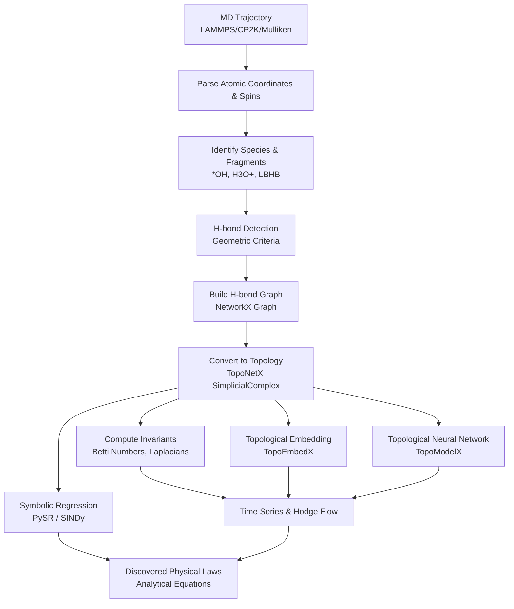

# Hydrogen Bond Network Topology Analysis

[](https://github.com/TANG-LAB-WHU/topoHBNet/actions/workflows/test.yml)
[](https://www.python.org/downloads/)
[](https://opensource.org/licenses/MIT)

Analyze hydrogen bond (H-bond) network topology from molecular dynamics trajectories (LAMMPS, CP2K) using **Topological Data Analysis (TDA)**, **TopoX Suite** (TopoNetX, TopoModelX, TopoEmbedX), and **Symbolic Regression (PySR / SINDy)**. Supports Betti number analysis, persistent homology, Topological Machine Learning (TML), and automated discovery of analytical physical laws governing transport dynamics.

## Overview

This package provides topological data analysis and symbolic regression tools for studying the dynamics of hydrogen bond networks, proton transfer mechanisms, and reactive species in water and aqueous interfacial systems.

### TopoX & Discovery Library Roles

| Library / Module | Function | Application in H-bond Analysis |
|------------------|----------|-------------------------------|
| **TopoNetX** | Topological data structures (SimplicialComplex, CellComplex) | Build topological representation of H-bond networks |
| **TopoModelX** | Topological Neural Networks (TNN) | Learn dynamic features and embeddings of H-bond networks |
| **TopoEmbedX** | Topological embedding algorithms (Cell2Vec, HOPE) | Generate low-dimensional representation vectors |
| **PySR / SINDy** | Symbolic Regression & Sparse Identification | Discover explicit, analytical physical equations relating topology to transport |

---

## Workflow



---

## Windows (CUDA) Deployment Guide

### Prerequisites: Environment Setup

#### Option A: Conda (Recommended for environment isolation)

```bash
# Create a new environment
conda create -n topoHBNet python=3.12 -y

# Activate the environment
conda activate topoHBNet
```

#### Option B: uv (Recommended for fast package management)

[uv](https://github.com/astral-sh/uv) is a fast Python package manager (10-100x faster than pip).

```bash
# Install uv (Windows PowerShell)
powershell -c "irm https://astral.sh/uv/install.ps1 | iex"

# Or via pip
pip install uv
```

### Step 1: Install PyTorch with CUDA (for RTX 5080 / Blackwell GPUs)

```bash
# Using uv (recommended)
uv pip install torch torchvision torchaudio --index-url https://download.pytorch.org/whl/cu129
uv pip install torch-scatter torch-sparse --find-links https://data.pyg.org/whl/torch-2.8.0+cu129.html

# Or using pip
pip install torch torchvision torchaudio --index-url https://download.pytorch.org/whl/cu129
pip install torch-scatter torch-sparse -f https://data.pyg.org/whl/torch-2.8.0+cu129.html
```

### Step 2: Clone and Install from Source (Recommended)

First, clone the repository from GitHub:

```bash
git clone https://github.com/TANG-LAB-WHU/topoHBNet.git
cd topoHBNet
```

Then, install the package in editable mode to allow for development and easy updates:

```bash
# Using uv (fastest)
uv pip install -e ".[full]"

# Or using pip
pip install -e ".[full]"
```

---

## macOS (Apple Silicon) Deployment Guide

For users with Apple Silicon (M1/M2/M3/M4) MacBooks, Apple uses Metal Performance Shaders (MPS) instead of NVIDIA CUDA. Additionally, compiling the underlying PyG graph computation libraries directly using Mac's default Clang compiler often triggers C++ template compilation errors.

To successfully deploy `topoHBNet` and activate MPS hardware acceleration, **you must skip the official `pip` or `pyg` installation channels and strictly follow this `conda-forge` based workflow.**

### 1. Prepare Conda Environment

It is highly recommended to use Miniconda or Miniforge. Open your terminal, create and activate a Python 3.12 environment:

```bash
conda create -n topoHBNet python=3.12 -y
conda activate topoHBNet
```

### 2. Install Pre-compiled PyTorch Stack via Conda-Forge

**(Critical Step: Do NOT use pip)**
The open-source community provides pre-compiled graph computation binaries perfectly adapted for the Mac ARM64 architecture on the `conda-forge` channel. Run the following command to completely avoid local C++ compilation waits and errors:

```bash
conda install pytorch torchvision torchaudio pytorch_scatter pytorch_sparse -c conda-forge -y
```

*(Note: We use underscores like `pytorch_scatter` here, unlike the hyphenated names in pip)*

### 3. Clone and Install the Project

Get the `topoHBNet` source code and install the project and other regular dependencies in developer mode:

```bash
# Clone the repository (if not already cloned)
git clone https://github.com/TANG-LAB-WHU/topoHBNet.git
cd topoHBNet

# Install the core project
pip install -e ".[full]"
```

### 4. Verify MPS Hardware Acceleration

After installation, run the following command in your terminal. If the output is `True`, your M-series hardware acceleration environment is fully ready:

```bash
python -c "import torch, torch_scatter; print('MPS Hardware Acceleration Ready:', torch.backends.mps.is_available())"
```

### 5. Running Tests

Now you can directly utilize your M-chip's compute power to process molecular dynamics trajectories:

```bash
# Run analysis workflow with Topological Machine Learning (TML)
python topoHBNet_main_analysis.py --trajectory examples/trajectory.xyz --run-ml --ml-dim 16
```

---

## Quick Start

### Command Line

```bash
# Basic trajectory analysis
python run_analysis.py trajectory.lammpstrj --output results/

# Analysis with Topological Machine Learning (TML)
python topoHBNet_main_analysis.py --trajectory trajectory.xyz --run-ml --ml-dim 16

# Correlate H-bond topology with transport & run Symbolic Regression (PySR)
python correlate_topology_and_transport.py \
    --topo-dir topoHBNet-run-ml \
    --proton-dir proton_transfer_results \
    --target-species *OH H3O+ \
    --run-pysr --pysr-procs 16
```

### Python API

```python
from hbond_topology import (
    TrajectoryParser,
    HBondDetector,
    HBondComplexBuilder,
    TopologicalInvariants,
    DynamicsAnalyzer,
    TopologyVisualizer
)

# Load trajectory
parser = TrajectoryParser("trajectory.lammpstrj")
frames = parser.parse()

# Analyze a single frame
detector = HBondDetector()
hbonds = detector.detect_hbonds(frames[0])

# Build simplicial complex
builder = HBondComplexBuilder()
sc = builder.build_from_frame(frames[0], hbonds)

# Compute topological invariants
invariants = TopologicalInvariants()
result = invariants.compute_all_invariants(sc)
print(f"Betti numbers: {result['betti_numbers']}")

# Full trajectory analysis
analyzer = DynamicsAnalyzer()
results = analyzer.analyze_trajectory(parser)

# Visualize
viz = TopologyVisualizer()
viz.plot_dynamics(results, save_path="dynamics.png")
```

---

## Topological Representation

### Simplicial Complex Structure

- **0-simplices (nodes)**: Water molecules (oxygen atoms)
- **1-simplices (edges)**: Hydrogen bonds
- **2-simplices (triangles)**: Three-water H-bond rings

### Computed Invariants

| Invariant | Symbol | Physical Meaning |
|-----------|--------|------------------|
| Betti-0 | β₀ | Number of connected components |
| Betti-1 | β₁ | Number of loops/holes |
| Betti-2 | β₂ | Number of voids/cavities |
| Euler Characteristic | χ | V - E + F |
| Hodge Laplacian | L₀, L₁ | Connectivity at each rank |

---

## H-bond Detection Criteria

Default geometric criteria:

| Parameter | Default | Description |
|-----------|---------|-------------|
| D-A distance | < 3.5 Å | Donor oxygen to acceptor oxygen |
| H-A distance | < 2.5 Å | Hydrogen to acceptor oxygen |
| D-H-A angle | > 120° | Angle at hydrogen |

Customize via:
```bash
python run_analysis.py trajectory.lammpstrj \
    --r-da-max 3.5 \
    --r-ha-max 2.5 \
    --angle-min 120
```

---

## Project Structure

```
hbond_topology/
├── io/
│   └── trajectory_parser.py    # LAMMPS/CP2K trajectory parsing
├── detection/
│   └── hbond_detector.py       # H-bond detection with PBC
├── topology/
│   ├── complex_builder.py      # TopoNetX construction
│   ├── invariants.py           # Topological invariants (Betti-0/1/2, Euler)
│   └── persistence.py          # Gudhi persistence homology
├── embedding/
│   └── embedder.py             # TopoEmbedX (Cell2Vec, HOPE)
├── learning/
│   ├── tnn_model.py            # HBondTNN, HBondGNN
│   ├── gnn_enhanced_tnn.py     # GNN-Enhanced TNN (hybrid model)
│   └── discovery.py            # PySR Symbolic Regression & SINDy physics discovery
├── analysis/
│   ├── dynamics.py             # Trajectory dynamics
│   ├── interfacial.py          # Interfacial water partitioning & spatial profiles
│   ├── proton_dynamics.py      # PMF, Wire length & Mulliken spin extraction
│   ├── persistence_visualizer.py
│   └── visualization.py        # Plotting & heatmaps
└── scripts/
    └── run_analysis.py         # CLI entry point

examples/
└── cp2k_aimd_*/                # 12 AIMD examples (field/nofield, interface/bulk, truncated)
    ├── correlate_topology_and_transport.py  # PySR & RF correlation pipeline
    └── trajectory_species_analysis.py       # Mulliken spin & species identification
```

---

## Output

| File | Description |
|------|-------------|
| `analysis_results.json` | Full topological invariants for each frame |
| `statistics_summary.json` | Summary statistics and TML parameters |
| `betti_dynamics.png` | Betti numbers (β₀, β₁, β₂) time series |
| `discovered_physical_law_{target}.md` | Discovered analytical physical equations from PySR |
| `target_selection_report.json / .csv` | Target variable evaluation and variance diagnostic report |
| `raw_data_csv/all_species_topological_r2_scores.csv` | Full Random Forest R² predictability leaderboard across species |
| `raw_data_csv/topological_feature_importance_{target}.csv` | Feature importance ranking of topological invariants |
| `raw_data_csv/pysr_consensus_equations_{target}.csv` | Voting consensus table of physical equations discovered by PySR |
| `raw_data_csv/topological_states_profiles.csv` | K-Means topological state profiles and transport properties |
| `embedding_pca.png` | PCA projection of topological embeddings |
| `frame_embeddings.npy` | Raw topological embedding vectors |

---

## Advanced Usage

### Topological Embedding

```python
from hbond_topology.embedding import HBondEmbedder

embedder = HBondEmbedder(method='cell2vec', dimensions=32)
embedding = embedder.fit_transform(sc)
```

### Persistence Homology

```python
from hbond_topology.topology import PersistenceAnalyzer

analyzer = PersistenceAnalyzer(max_edge_length=5.0, max_dimension=2)
result = analyzer.analyze_frame(water_positions)

# Betti curve
scales, betti = analyzer.compute_betti_curve(result['persistence'], dimension=1)

# Persistence landscape (for ML)
landscape = analyzer.compute_persistence_landscape(result['persistence'], dimension=1)
```

### Topological Neural Network

```python
from hbond_topology.learning import HBondTNN, prepare_tnn_data

# Prepare data
data = prepare_tnn_data(sc)

# Create and use model
model = HBondTNN(in_channels=1, hidden_channels=32, out_channels=16)
edge_features, graph_pred = model(
    data['edge_features'], 
    data['laplacian_up'], 
    data['laplacian_down']
)
```

### Lightweight GNN (No TopoModelX Required)

```python
from hbond_topology.learning import HBondGNN

# Simple GNN for H-bond networks
model = HBondGNN(in_channels=1, hidden_channels=32, out_channels=16)
node_emb, graph_pred = model(node_features, adj)
```

### GNN-Enhanced TNN (Experimental)

```python
from hbond_topology.learning import GNNEnhancedTNN, prepare_gnn_tnn_data

# Prepare data
data = prepare_gnn_tnn_data(sc)

# Create hybrid model (GNN + TNN fusion)
model = GNNEnhancedTNN(
    node_in_channels=1,
    edge_in_channels=1,
    hidden_channels=32,
    out_channels=16,
    fusion='parallel'  # or 'residual'
)

out = model(
    data['node_features'],
    data['edge_features'],
    data['adj'],
    data['laplacian_up'],
    data['laplacian_down']
)
```

### Symbolic Regression & Physical Law Discovery (PySR)

```python
from hbond_topology.learning.discovery import SymbolicRegressor

# Discover analytical equations relating topological invariants to transport
regressor = SymbolicRegressor(
    niterations=100,
    binary_operators=["+", "*", "-", "/"],
    unary_operators=["exp", "log", "sqrt"],
    model_selection="best"
)

# Fit topological invariants against target transport property
regressor.fit(X_topo, y_transport, feature_names=["betti_0", "betti_1", "euler_characteristic", "LBHB_Fraction"])

# Discovered explicit physical formula
print("Discovered Law:", regressor.get_best_equation())
print("Pareto Front Equations:\n", regressor.get_pareto_front())
```

---

## Technical Notes

> **Periodic Boundary Conditions**: H-bond detection uses minimum image convention for PBC-aware distance calculations.

> **Large Trajectories**: For long trajectories, consider batch processing with `--start`, `--stop`, `--step` flags.

> **GPU Acceleration**: TopoModelX utilizes PyTorch for GPU-accelerated TNNs. The package automatically detects CUDA and supports high-performance GPUs (including NVIDIA RTX 5080 5090 / Blackwell).

---

## References

1. Hajij et al. 2023. [TopoX: A Suite of Python Packages for Machine Learning on Topological Domains](https://arxiv.org/abs/2402.02441)
2. Papillon et al. 2023. [Architectures of Topological Deep Learning: A Survey on Topological Neural Networks](https://arxiv.org/abs/2304.10031)
3. Hajij et al. 2023. [Topological Deep Learning: Going Beyond Graph Data](https://arxiv.org/abs/2206.00606)
